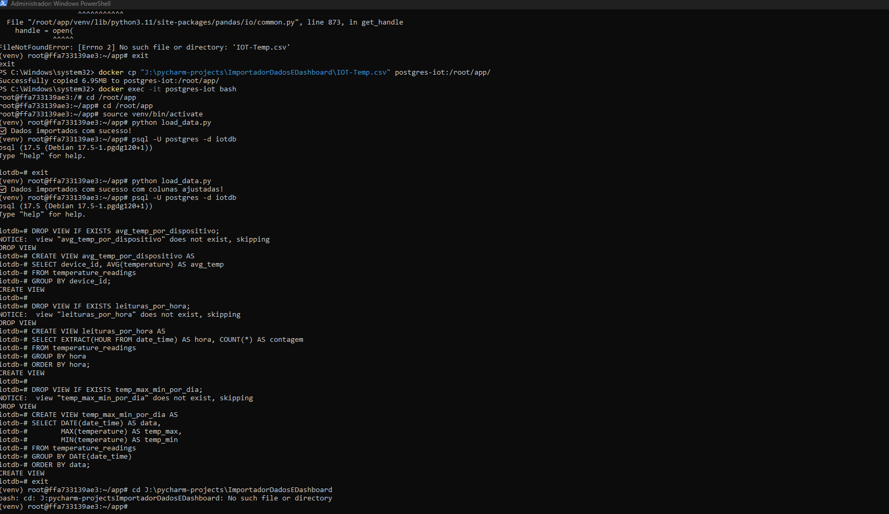
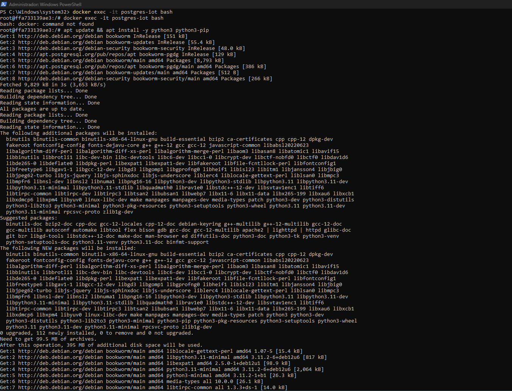
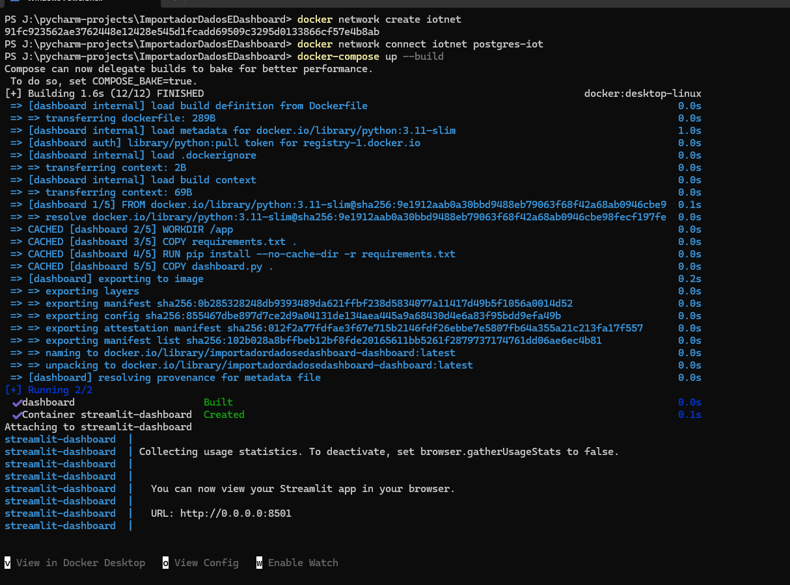
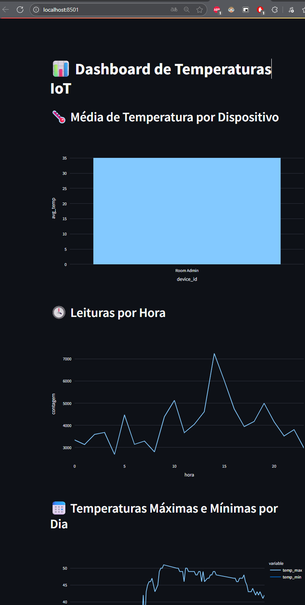
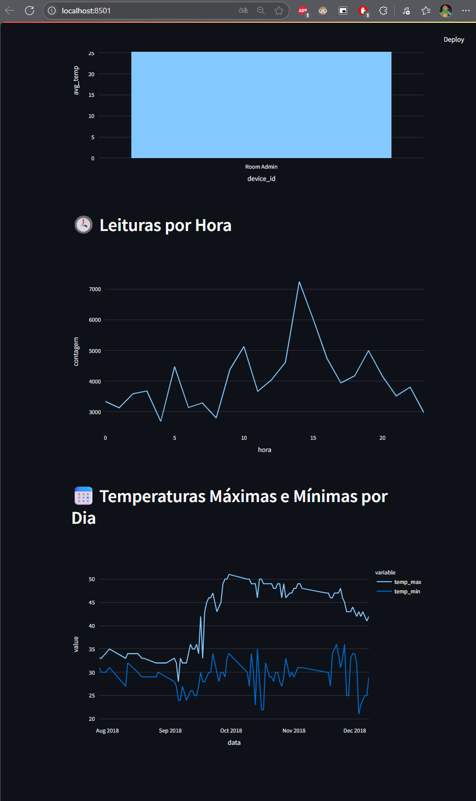
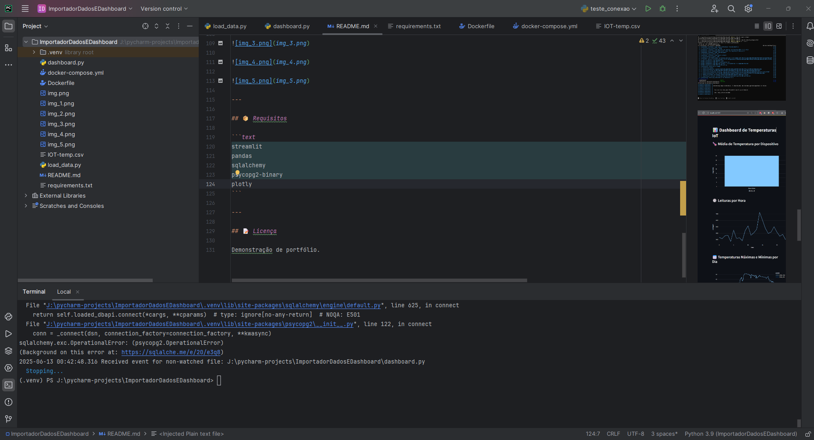
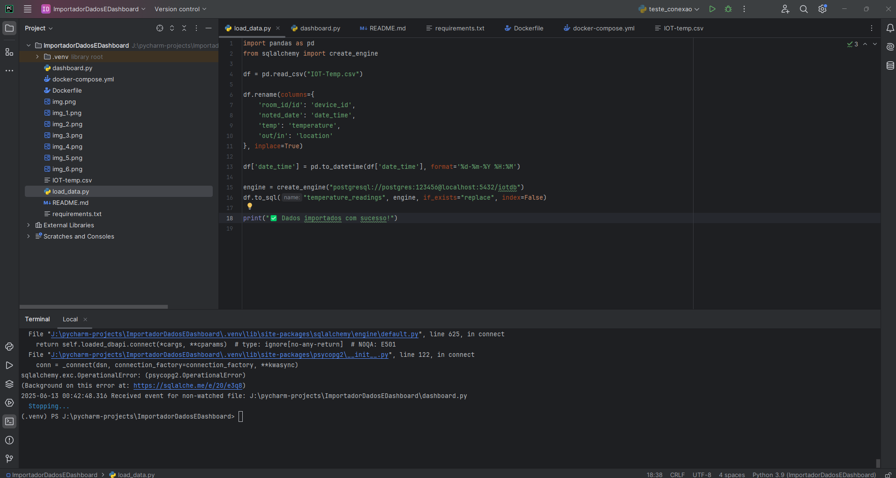

# 📡 Projeto: Pipeline de Dados IoT com Docker, PostgreSQL e Streamlit

## 🎯 Objetivo

Construir um pipeline completo que importa dados de sensores IoT (temperatura), processa e armazena no PostgreSQL, e visualiza em um dashboard interativo com Streamlit — tudo em containers Docker.

---

## 🧱 Tecnologias Utilizadas

- Python 3.11
- Docker + Docker Compose
- PostgreSQL
- Pandas + SQLAlchemy
- Streamlit + Plotly
- Dataset Kaggle: Temperature Readings - IoT Devices

---

## 📁 Estrutura do Projeto

```
ImportadorDadosEDashboard/
│
├── dashboard.py              # App Streamlit
├── load_data.py              # Importação do CSV no banco
├── requirements.txt          # Dependências do dashboard
├── Dockerfile                # Container do dashboard
├── docker-compose.yml        # Orquestra o dashboard
├── IOT-Temp.csv              # Dataset importado (Kaggle)
└── README.md                 # Este arquivo
```

---

## 🐳 Como Rodar com Docker

1. Clone o repositório:
   ```bash
   git clone https://github.com/Felipe-Serna/ImportadorDadosEDashboard.git
   cd pipeline-dados-iot
   ```

2. Crie a rede Docker (caso ainda não exista):
   ```bash
   docker network create iotnet
   docker network connect iotnet postgres-iot
   ```

3. Suba o dashboard:
   ```bash
   docker-compose up --build
   ```

4. Acesse o dashboard:
   👉 http://localhost:8501

---

## 📊 Funcionalidades do Dashboard

- **Média de temperatura por dispositivo**
- **Leituras por hora do dia**
- **Temperaturas máximas e mínimas por dia**

---

## 🧠 Insights Observados

- Leituras se concentram entre 8h e 18h
- Sensores internos têm menor variação de temperatura
- Há dias com temperatura externa superior a 40°C

---

## 🗃️ Views SQL Criadas

```sql
-- Média por dispositivo
CREATE VIEW avg_temp_por_dispositivo AS
SELECT device_id, AVG(temperature) AS avg_temp
FROM temperature_readings
GROUP BY device_id;

-- Leituras por hora
CREATE VIEW leituras_por_hora AS
SELECT EXTRACT(HOUR FROM date_time) AS hora, COUNT(*) AS contagem
FROM temperature_readings
GROUP BY hora
ORDER BY hora;

-- Temperatura máxima/mínima por dia
CREATE VIEW temp_max_min_por_dia AS
SELECT DATE(date_time) AS data,
       MAX(temperature) AS temp_max,
       MIN(temperature) AS temp_min
FROM temperature_readings
GROUP BY DATE(date_time)
ORDER BY data;
```

---

## 📸 Capturas de Tela














---

## 📦 Requisitos

```text
streamlit
pandas
sqlalchemy
psycopg2-binary
plotly
```

---

## 📝 Licença

Demonstração de portfólio.
